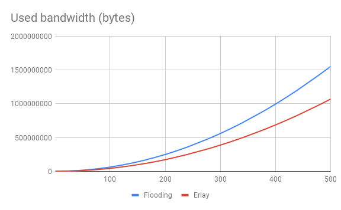

## Actix-based Erlay simulator

This is an [Actix]-based simulator for evaluation of [Erlay] transaction propagation technique.

It includes:

* `Peer` actor that can be either **public** or **private**
* `RecSet` -- a set with reconciliation using [minisketch-rs]
* `TrafficCounter` actor that reads reports on used traffic from peers
* Various protocol messages for connection, tx propagation and set reconciliation

>Note that set difference estimation and sketch bisection are omitted in this simulator. 
However, this can change in future.

It creates a network of public and private peers. 
Each private peer announces a single transaction of 1024 bytes to a single random outbound peer.

Short IDs of the transactions are based on [SipHash2-4] and are 64-bit wide.

### Example

Let's create a simple network and simulate both [Erlay] and flooding transaction propagation strategies.

#### Flooding

Run simulator with following parameters:

```bash
cargo run -- --numprivate=8 --numpublic=2
```

It will produce following network of peers:


* Two (2) **public** peers that do have inbound connections
* Eight (8) **private** peers that don't have inbound connections

Simple transaction flooding will produce `429488` bytes of traffic.

Traffic per peer:
```
pub0: 73280 ↑ 23816 ↓ (bytes)
pub1: 67088 ↑ 67160 ↓ (bytes)
priv0: 9288 ↑ 15480 ↓ (bytes)
priv1: 9288 ↑ 15480 ↓ (bytes)
priv2: 9288 ↑ 15480 ↓ (bytes)
priv3: 9288 ↑ 15480 ↓ (bytes)
priv4: 9288 ↑ 15480 ↓ (bytes)
priv5: 9288 ↑ 15480 ↓ (bytes)
priv6: 9288 ↑ 15480 ↓ (bytes)
priv7: 9288 ↑ 15480 ↓ (bytes)

```

#### [Erlay] (low-fanout flooding + set reconciliation)

Now we enable [Erlay] which is using set reconciliation (`-r` flag) instead of flooding for tx propagation:

```bash
cargo run -- --numprivate=8 --numpublic=2 -r
```

In this case, overall traffic will be `357488` bytes.

Traffic per peer:
```
pub0: 75928 ↑ 21752 ↓ (bytes)
pub1: 75928 ↑ 23816 ↓ (bytes)
priv0: 3352 ↑ 16656 ↓ (bytes)
priv1: 3352 ↑ 16656 ↓ (bytes)
priv2: 3352 ↑ 16656 ↓ (bytes)
priv3: 3352 ↑ 16656 ↓ (bytes)
priv4: 3352 ↑ 16656 ↓ (bytes)
priv5: 3352 ↑ 16656 ↓ (bytes)
priv6: 3352 ↑ 16656 ↓ (bytes)
priv7: 3352 ↑ 16656 ↓ (bytes)
```

As we can see, [Erlay] benefits us with `100 - 357488.0 / 429488.0 * 100 = 16.8`% bandwidth reduction, mostly for private nodes.

### Graphs

1. Used bandwidth in bytes depending on number of private nodes (1-500) with two (2) public nodes:
    
2. Used bandwidth in bytes depending on number of private nodes (10-300) with eight (8) public nodes:
    

[SipHash2-4]: https://docs.rs/siphasher/0.3.0/siphasher/sip/struct.SipHasher24.html
[Actix]: https://github.com/actix/actix
[Erlay]: https://arxiv.org/pdf/1905.10518.pdf
[minisketch-rs]: https://github.com/eupn/minisketch-rs
